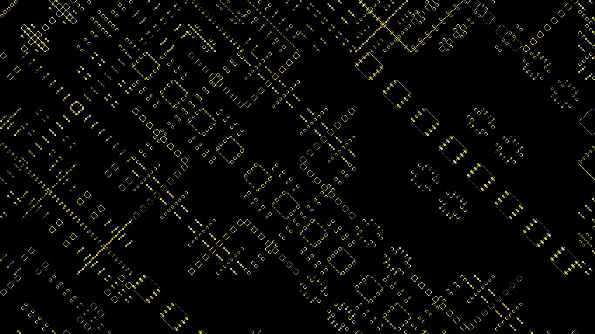
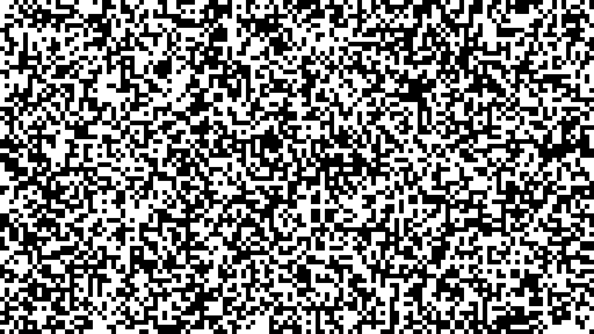
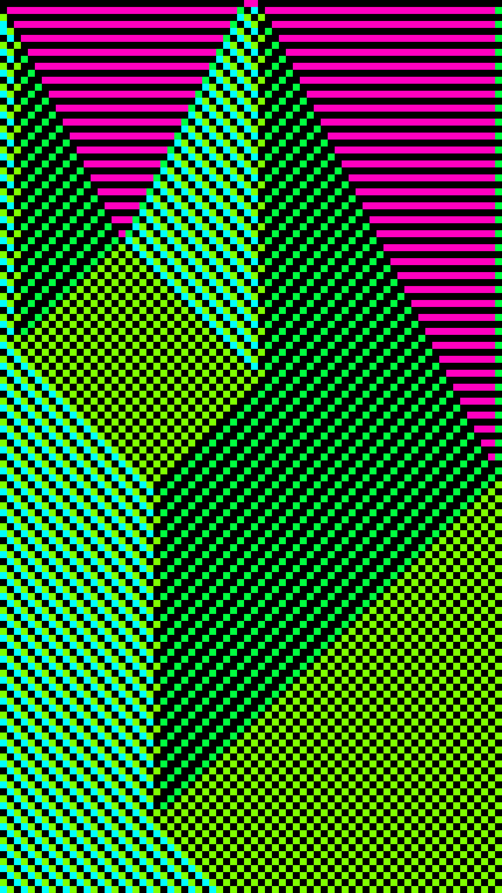
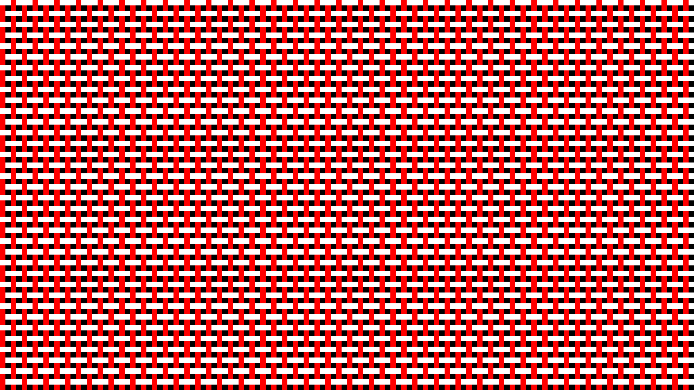
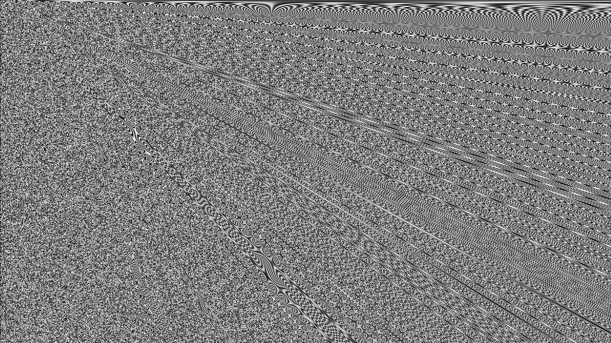

# What is this?
Hi. Those are my old Paint.NET plugins, which usually render some kind of pattern.  
They were written for old Paint.NET versions, so they don't work now.  

Update: I've ported some of them to Paint.NET 5, so you can take a look.  
What works:
 - Paint.XOR
 - Paint.RND
 - Paint.Basket
 - Paint.GEN (kind of)

So what do they do?

## Paint.XOR
What happens, if you XOR an X and Y coordinates?  
You'll get a number.  
If you filter out the numbers, that are not primes, an interesting pattern emerges.
### Example output:

### More at: [flickr.com](https://flic.kr/s/aHBqjCqGVB)  
An important note:  
My examples are not "pure", meaning that the pictures are not raw outputs of the plugin, but a result of an artistic process applied to the raw images.  
But you can get the idea, the pattern is recognizable across all the pictures.

---------------------------------------

## Paint.RND
Just a configurable random noise generator.
### Example output:

---------------------------------------

## Paint.ECA
Elementary Cellular Automaton implementation as a Paint.NET plugin.  
__This is not working with Paint.NET 5 yet.__
### Example output:

### More at: [flickr.com](https://flic.kr/s/aHBqjCqMcp)

---------------------------------------

## Paint.Basket 
Just a cute pattern. Various options are configurable.

### Example output:

---------------------------------------

## Paint.GEN
Basically, it randomly stacks up mathematical functions on the X and/or Y coordinate(-s) of the image.  
The old version produced more interesting patterns, but was unusable, because I used a different approach.

### Example output:

### More at: [flickr.com](https://flic.kr/s/aHBqjCqHx4)